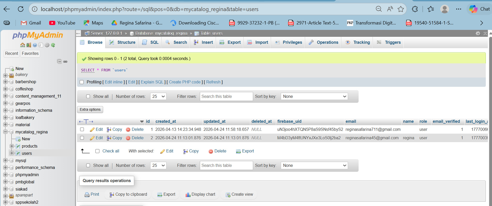

# toko_sepatu_heels_wanita

## 👤 Profil Pengembang
- **Nama**      : Regina Safarina
- **Kelas**     : TI SE 2
- **Prodi**    : Teknik Informatika | Software Engineering
- **NIM**       : 1123150124

---

## Tampilan UI Aplikasi Toko sepatu heels wanita
- **Nama** : Toko sepatu heels wanita

## 📸 Screenshots

  
   
    
    
    
    
    

## Database MYSQL
- **Name** : mycatalog_regina

  
  
  
## Backend API
- **Name** : Backend Golang

  
  

## Link Youtube
 https://youtu.be/YalLW2QtFPw
 https://youtu.be/w-9mycdDZNc (pt 2)
 
