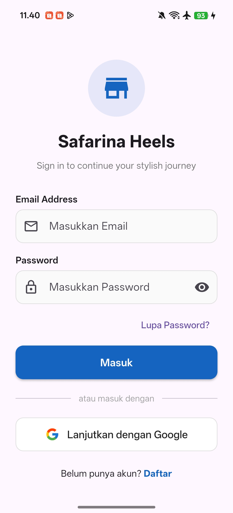
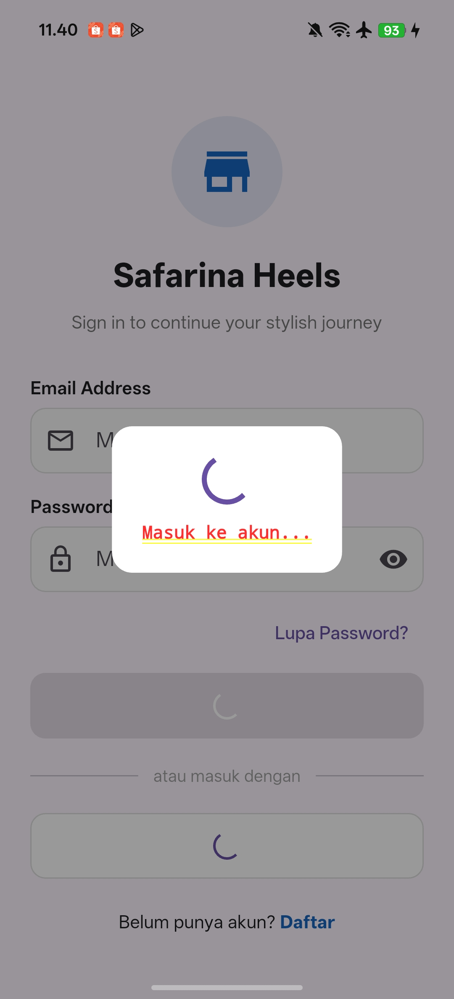
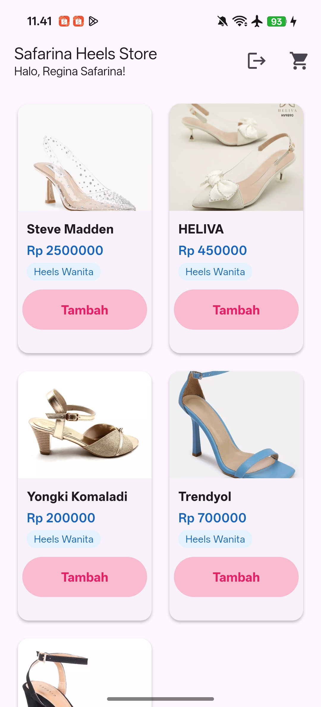
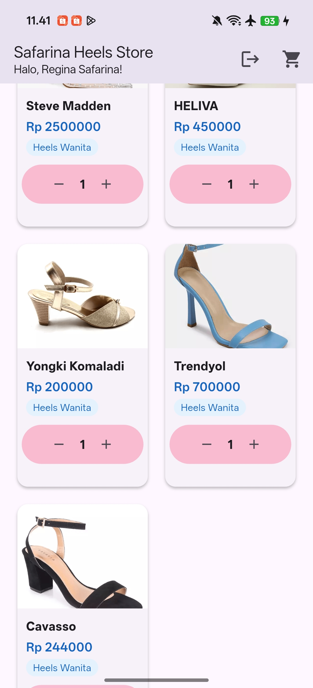
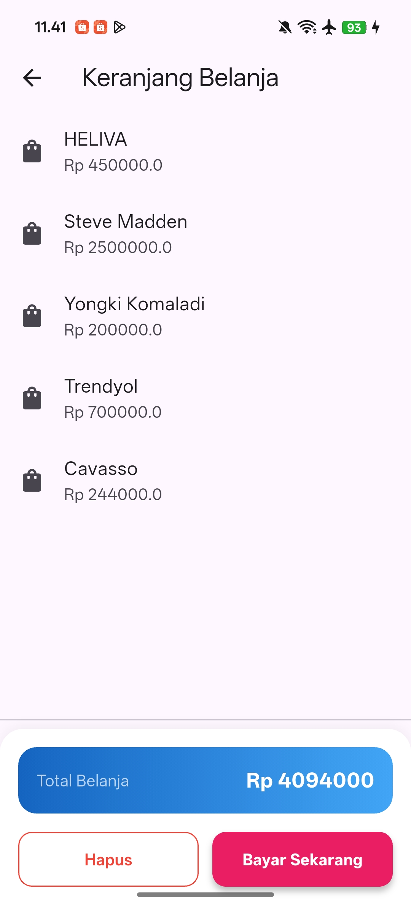
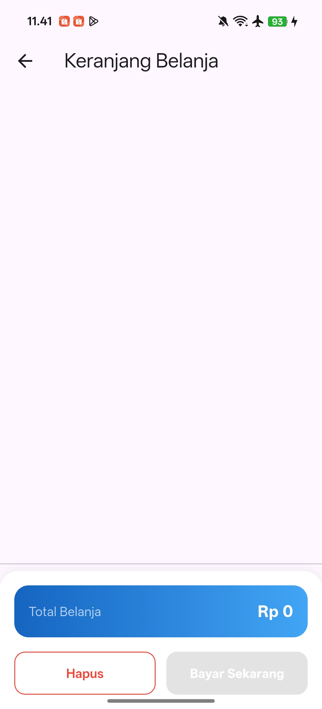
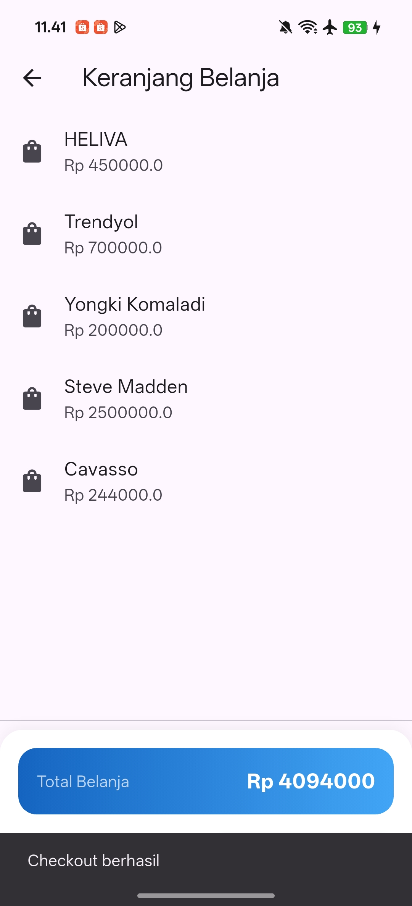
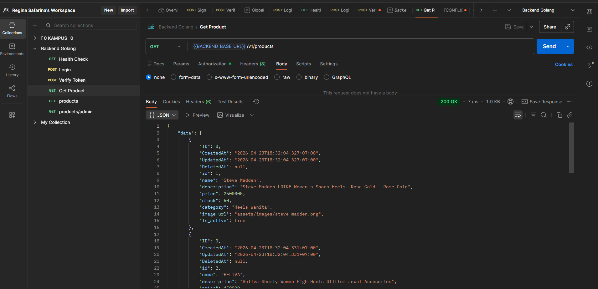
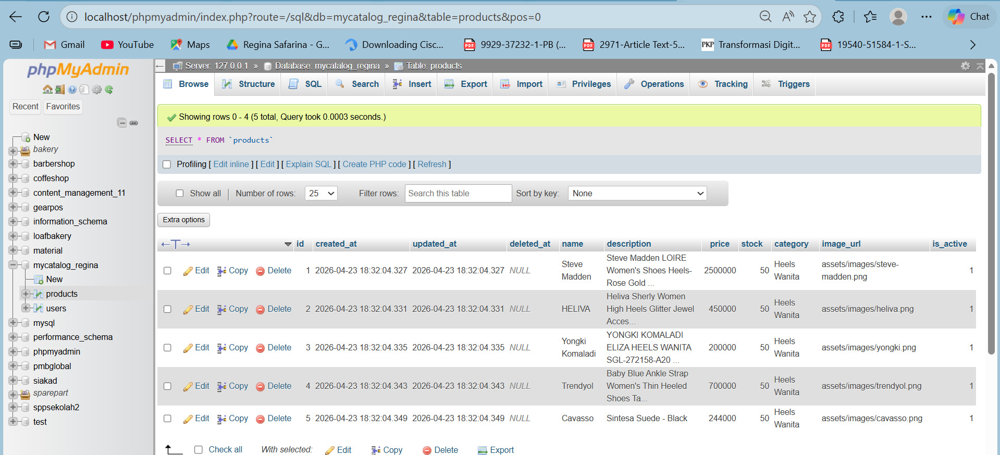
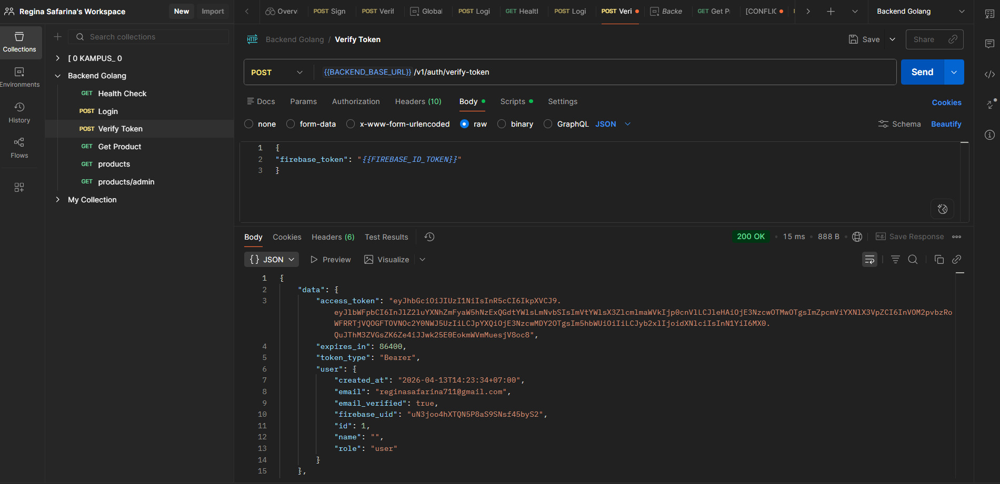

# toko_sepatu_heels_wanita

## 👤 Profil Pengembang
- **Nama** : Regina Safarina
- **Kelas** : TI SE 2 23 P2
- **Prodi** : Teknik Informatika | Software Engineering

---

## Aplikasi Catalog
- **Nama** : Tokosepatu heels wanita

## 📸 Screenshots

  
   
    
    
    
    
    

## Database MYSQL
- **Nama** : mycatalog_regina

  
  
  
## Backend API
- **Nama** : Backend Golang

  
  